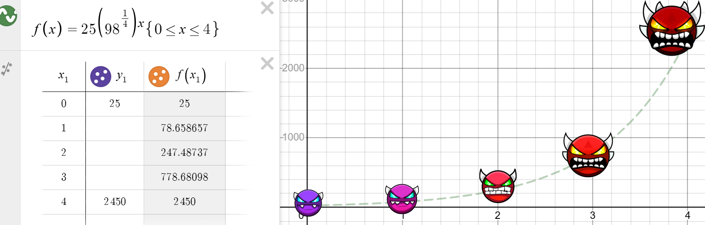
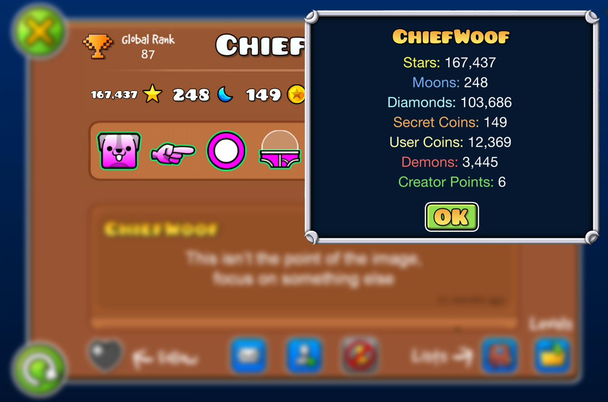
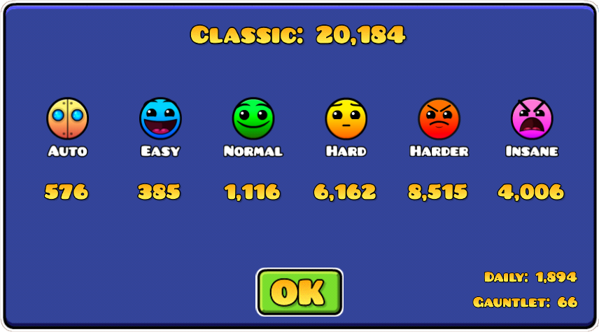
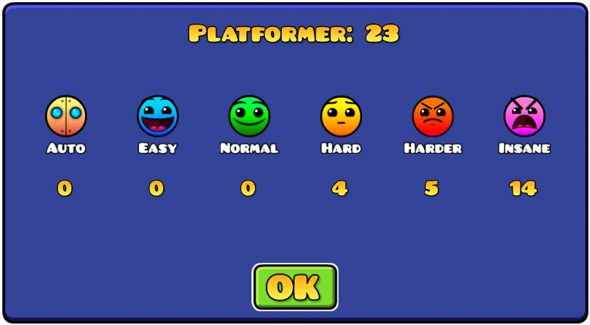
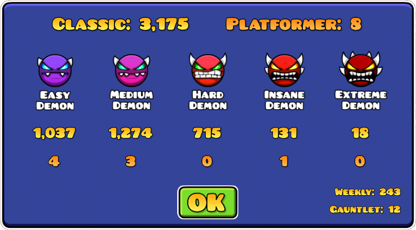

# Net Score
Informally known as "GD Experience," net score is the equalization of stats and merge them into one numeric value

> [!CAUTION]
> For the purpose of simplicity, some values in the formula are rounded down to the nearest whole number. For exact values, see the derivation calculations

### Glossary
* [How it's calculated](#how-its-calculated)
    * [Derivation](#derivation)
        * [Followed Guidelines](#followed-guidelines)
        * [The base stats](#the-base-stats)
            * [Stars & Moons](#derivation_stars) 
            * [Diamonds](#derivation_diamonds)
            * [Coins](#derivation_coins)
            * [Demons](#derivation_demons)
            * [CP](#derivation_cp)
        * [Additions](#additions)
            * [Demon Expansion](#demon-expansion)
    * [Derived Formula](#derived-formula)
* [Example](#example)

# How it's calculated

## Derivation

> ### Followed Guidelines
> * Consider older, retired players who won't load new available stats (if they require loading)
> * Timely-avaiable levels should have a low weight (if at all) as not all players will be able to experience them
> * Only readily available stats (profile stats for example) should be used
> * Creator Points is considered a hard stat to obtain. It should always have a high (if not highest) weight
> * Weights should be whole, positive numbers

### The base stats

  Stars was the first and is also the primary stat in Geometry Dash to exist, collected by completing levels. For these reasons, it's used as the base weight for majority of the other stats. The addition of moons in GD 2.2 brought a new gameplay style for levels. However, the collecting style between the two is practically the same and therefore stars and moons get weighted the same. 5 points was picked which also included providing some room for diamonds. It's worth noting these two values are independent of one another.
* Stars = +5xp
* Moons = +5xp

 Diamonds are both free to obtain, by opening chests, and grinded for by playing Timely-available levels. Because diamonds are more easily obtainable than it is to grind for them, it should be worth less than half of stars (x < 2.5). 2xp was decided in order to not make diamonds worthless while also keeping it a whole number
* Diamonds = +2xp

  Secret coins and user coins are obtained similarly, by playing and completing levels. Since the level must be completed, their weights should be more than that of stars. The focused difference between the two coin types are easibility in obtaining. Secret coins are known to not be as free as a lot of user coins are. Therefore, they should be worth slightly more than user coins

Each user coin in a level is independently obtained and therefore a multiple of 3 (the maximum user coins per level) is found. Using an auto level (+1 star as a base, signified by "1a") with the maximum user coins we can derive a theoretically xp value:

* 1a \* 3 = (+5xp) \* 3 = +15xp

Then, by using the previous statement that indirectly indicated that secret coins are more valuable, a manual adjustment to the theoretically xp value can be done:

* Secret coins = +15xp
* User coins = +10xp

 Demon value is simply determined by stars value.

> [!NOTE]  
> *Demons are not guaranteed to be worth 10 stars but every online demon has always been given 10 stars up to date*

* Demons = (stars xp) \* 10 = (+5xp) \* 10 = +50xp

However, stars already factors in the XP value (doubling the value). Because the value gets doubled, dividing it by 2 calculates an adjusted value

* Demons/2 = +25xp

 Creator points, in theory, take a long time and a lot of work to obtain. Therefore, they should be much more valuable than any other base stat in order to balance this stat out alongside the other stats. Additionally, creator points are completely independent to that of star count and is therefore not directly comparable to any of the base stats

A feasible solution is to use a summation calculation to determine the total weight of the other base stats using a 10 star level (the reasonable maximum for a user created level) as a theoretical focal point. Then, proceed to make a manual adjustment to award creator points with more total weight to keep to the guidelines

* Stars \* 10 = +50xp OR Moons \* 10 = +50xp
* Diamonds (using the 5/2 ratio) \* 10 = +25xp
* Secret coins \* 10 = +150xp
* User coins \* 10 = +10xp
* Demons \* 10 = +500xp
* <b>Sum = +735xp (stars/moons do not overlap so only 1 is counted)</b>

This summation can be rounded to +1,000xp which also provides creator points the balance buff

## Additions
> |   |  |  |  |  |  |  |  |
> | - | - | - | - | - | - | - | - |
> | +XP\*1 | +5 | +2 | +15 | +10 | +25 | +1,000 | +5 |

 
With the base stats now derived, they can be applied in order to determine other stats primarily through simple algebra

###  Demon Expansion
With the inclusion of demon types into the experience, extreme demons (because of the difficulty) was determined much more valuable than creator points while the other demon difficulities were below creator points. With extreme demons being more complex to verify/complete than to build, and with time consideration, extreme demons is given +2,450xp.

An exponential model was chosen to account for the *extreme* difference in involved skill and time between an easy demon and an extreme demon This model awards the base value (Easy Demon) the original demon xp value (+25xp) while the highest awarded value (Extreme Demon) is +2,450xp. Where x is the demon difficulty (easy = 0, medium = 1, hard = 2, insane = 3, extreme = 4), an exponential equation can be used to model this:

> [!IMPORTANT]  
> |   |  |  |  |  |  |
> | - | - | - | - | - | - |
> | x | 0 | 1 | 2 | 3 | 4 |

* +xp = (base) \* $C^x$ = 25 \* $C^x$

With a bit of algebra, we can determine C:
* (2,450) = 25 \* $C^{(4)}$
* C = $\sqrt[4]{98}$ = 3.146346... ≈ π

Plugging in values is the derivation of the xp formula for demon difficulty is derived and can be used to determine the xp for other demon difficulties
* +xp = 25 \* ${(\sqrt[4]{98})}^{x}$
* +xp ≈ 25 \* $π^{x}$

## Derived Formula

Putting it all together, the amount of awarded xp per 1 of each stat is below. Using these ratios and a summation is the net score

> |   |  |  |  |  |  |  |  |  |  |  |  |
> | - | - | - | - | - | - | - | - | - | - | - | - |
> | +XP\*1 | +5 | +2 | +15 | +10 | +25 | +78 | +247 | +778 | +2,450 | +1,000 | +5 |

> [!IMPORTANT]  
> This is the full, theorectical calculation. Geometry Dash contains several statistical inconsistencies for a multitude of reasons. These should be accounted for where possible

### Demon Inconsistencies
One of these inconsistencies is the number of total demons does not match when comparing the actual total number of demons and total number of demons through difficulty/gameplay statistics

The amount of missing demons (profile - statistical) is multiplied by regular demon multiplier. Since using the demon extension does not factor in profile demon count, a max function is used to prevent negative experience gains. The additional awarded xp is as follows:
* +xp = max(profile - statistical, 0) \* 25

# Example

 

Note: *each displayed entry is rounded down to the nearest whole number. However, each final value is not rounded down until the very end of its calculation*

| Stat | +XP\*1 | Stat Value | +XP |
| - | - | - | - |
|  | +5 | 167,437 | +837,185 |
|  | +2 | 103,686 | +207,372 |
|  | +15 | 149 | +2,235 |
|  | +10 | 12,369 | +123,690 |
|  | +25 | 1,041 | +26,025 |
|  | +78 | 1,277 | +100,447 |
|  | +247 | 715 | +176,953 |
|  | +778 | 132 | +102,785 |
|  | +2,450 | 18 | +44,100 |
|  | +1,000 | 6 | +6,000 |
|  | +5 | 248 | +1,240 |
| total |   |   | 1,628,033 |

Theorectical Net Score = 1,628,033

* <u>Demon Inconsistency Adjustment</u>
    * max(profile - statistical, 0) \* 25
    * = max(3445 - (3,175 + 8), 0) \* 25
    * = 262 \* 25
    * = +6,550

Net Score = 1,634,583
